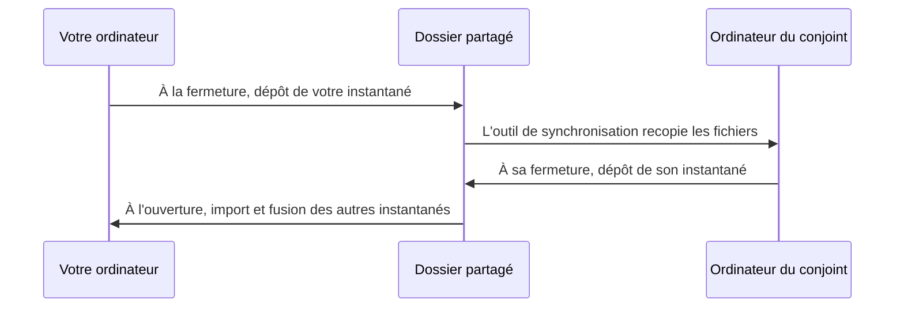

# grossbuch

grossbuch est une application de comptabilité familiale pour Linux : on y saisit rapidement ses dépenses classées par catégories, on consulte un récapitulatif au mois ou à l'année, et on suit l'évolution des dépenses totales d'une année sur l'autre. Les données restent sur votre ordinateur, dans une base locale, et peuvent être partagées entre plusieurs machines d'un même foyer sans serveur ni compte en ligne.

Ce document est avant tout un guide d'utilisation. La feuille de route et les informations destinées aux développeurs se trouvent en fin de page. Les choix techniques et le modèle de données sont documentés sous forme d'ADR dans [docs/adr/](docs/adr/).

## Sommaire

- [Fonctionnalités](#fonctionnalités)
- [Installation](#installation)
- [Guide d'utilisation](#guide-dutilisation)
- [Partager les données entre plusieurs ordinateurs](#partager-les-données-entre-plusieurs-ordinateurs)
- [Sauvegardes, import et export](#sauvegardes-import-et-export)
- [Les catégories](#les-catégories)
- [Où sont stockées mes données](#où-sont-stockées-mes-données)
- [Feuille de route](#feuille-de-route)
- [Pour les développeurs](#pour-les-développeurs)

## Fonctionnalités

- Saisie rapide des dépenses par catégorie et sous-catégorie, avec libellé facultatif, modification et suppression d'une dépense isolée.
- Dépenses récurrentes reportées automatiquement sur le mois en cours, modifiables pour l'avenir seulement et désactivables sans perte de l'historique.
- Récapitulatif agrégé par catégorie et sous-catégorie, pour un mois précis ou une année entière, avec total général.
- Graphiques des dépenses totales mensuelles, superposables d'une année sur l'autre, limités aux mois réellement renseignés.
- Partage des données entre plusieurs ordinateurs par simple dossier partagé, avec fusion automatique et sans serveur.
- Sauvegardes automatiques horodatées avec rotation, sauvegarde systématique avant import et restauration depuis l'application.
- Import et export par fichier d'échange portable, avec rapport de fusion détaillé.
- Stockage local SQLite, montants gérés en centimes pour éviter les erreurs d'arrondi, interface francophone.

## Installation

Téléchargez le paquet `grossbuch_<version>-1_amd64.deb` depuis la page des releases du dépôt, puis installez-le avec apt, qui résout automatiquement les dépendances Qt :

```sh
sudo apt install ./grossbuch_<version>-1_amd64.deb
```

L'application apparaît ensuite dans le menu de votre environnement de bureau, ou se lance depuis un terminal avec la commande `grossbuch`. Au premier démarrage, la base de données et la liste des catégories sont créées automatiquement : il n'y a rien à configurer pour commencer à saisir.

Une AppImage est également publiée pour chaque version, comme format de secours sur les distributions non-Debian. Il s'agit d'un fichier unique, sans installation : téléchargez `grossbuch-x86_64.AppImage`, rendez-le exécutable puis lancez-le.

```sh
chmod +x grossbuch-x86_64.AppImage
./grossbuch-x86_64.AppImage
```

Sur les systèmes dérivés de Debian, préférez le paquet `.deb`, mieux intégré au bureau et mis à jour par apt.

## Guide d'utilisation

L'application se pilote entièrement par une barre de menus (Fichier, Édition, Affichage, Aide) et n'affiche qu'une seule vue à la fois, pour rester lisible. Les raccourcis Ctrl+1 à Ctrl+4 basculent directement d'une vue à l'autre. Au lancement, l'application ouvre les graphiques de l'année en cours.

### Saisir une dépense

Ouvrez la vue de saisie par le menu Édition puis Saisie des dépenses (Ctrl+1). Indiquez le montant et la date, choisissez la sous-catégorie (ou la catégorie si elle n'a pas de sous-catégories) dans la liste déroulante groupée, et ajoutez si vous le souhaitez un libellé facultatif. La dépense s'ajoute aussitôt à la liste des dépenses du mois en cours affichée en dessous. Pour corriger une erreur, sélectionnez une dépense dans cette liste afin de la modifier ou de la supprimer.

### Dépenses récurrentes

La vue Dépenses récurrentes (menu Édition, Ctrl+2) gère les paiements qui reviennent chaque mois, comme un abonnement ou un loyer. Vous définissez un modèle une seule fois et il est automatiquement reporté sur le mois en cours. Lorsque vous modifiez un modèle, seul l'avenir est concerné : les occurrences déjà enregistrées ne sont jamais réécrites, ce qui préserve l'exactitude de l'historique. Un modèle peut être désactivé puis réactivé à tout moment, sans perdre les occurrences passées.

### Consulter le récapitulatif

La vue Récapitulatif (menu Affichage, Ctrl+3) présente un tableau des dépenses agrégées par catégorie, avec le détail par sous-catégorie et un total général. Vous choisissez d'afficher un mois précis ou une année entière, ce qui permet aussi bien le suivi mensuel que le bilan annuel.

### Visualiser les graphiques

La vue Graphiques (menu Affichage, Ctrl+4) trace, pour chaque année enregistrée, la courbe des dépenses totales mois par mois. Les courbes se superposent pour comparer les années entre elles ; au lancement seule l'année en cours est affichée, et vous pouvez activer les autres années à votre convenance. Seuls les mois réellement renseignés apparaissent sur la courbe.

## Partager les données entre plusieurs ordinateurs

grossbuch permet à plusieurs personnes d'un même foyer de travailler sur les mêmes données, chacune sur son ordinateur, sans serveur. Le principe est simple : vous désignez un dossier partagé, synchronisé par un outil que vous utilisez déjà (Syncthing, Nextcloud, Dropbox ou équivalent), et chaque machine y dépose son propre instantané. La base de données vivante n'est jamais partagée directement ; seuls les instantanés le sont, puis sont fusionnés dans chaque base locale.

Pour mettre cela en place, ouvrez le menu Fichier puis Configurer la synchronisation, indiquez le dossier partagé et, si vous le souhaitez, activez la synchronisation automatique. Une fois l'option automatique active, l'application importe et fusionne les instantanés des autres appareils à chaque ouverture, et dépose le sien à chaque fermeture. À tout moment, l'entrée de menu Synchroniser maintenant force un échange immédiat.



La fusion se fait ligne par ligne, par identifiant unique, selon la règle « la modification la plus récente l'emporte », et les suppressions se propagent proprement d'une machine à l'autre. Vous pouvez donc saisir chacun de votre côté, même hors ligne, sans risque d'écraser le travail de l'autre.

## Sauvegardes, import et export

L'application réalise seule des sauvegardes horodatées de la base et n'en conserve qu'un nombre limité, les plus récentes, pour ne pas encombrer le disque. Une sauvegarde complète est également créée systématiquement avant tout import. Pour revenir en arrière, utilisez le menu Fichier puis Restaurer une sauvegarde et choisissez la copie voulue dans la liste.

Le menu Fichier propose aussi un export vers un fichier d'échange et un import depuis un tel fichier. L'export produit un fichier portable qui sert à la fois de transfert et de sauvegarde lisible à long terme. L'import fusionne le fichier choisi avec vos données actuelles et affiche un rapport des ajouts, mises à jour, suppressions et conflits ; une confirmation vous est demandée au préalable, en rappelant qu'une sauvegarde automatique est créée avant l'opération.

## Les catégories

La hiérarchie est pré-remplie au premier lancement et reste stable dans le temps :

- Alimentation → Courses · Restaurants
- Vêtements → Adultes · Enfants
- Déplacements → Transports en commun · Vélo · Voiture · Train
- Éducation → École · Loisirs · Centres aérés · Formation continue
- Livres et jeux → Adultes · Enfants
- Santé → Adultes · Enfants
- Maison → Résidence principale · Résidence secondaire
- Sorties → Musées · Sport · Spectacles · Babysitter
- Cadeaux et dons
- Voyages

Une dépense s'attache à une sous-catégorie lorsqu'il en existe, sinon directement à la catégorie. Le récapitulatif agrège par catégorie racine avec le détail par sous-catégorie, tandis que les graphiques n'utilisent que le total général.

## Où sont stockées mes données

Vos données vivent dans une base SQLite sous `~/.local/share/grossbuch/grossbuch.db`, et les sauvegardes automatiques sont conservées à côté. Les montants sont stockés en centimes afin d'éviter toute erreur d'arrondi. Les préférences, comme le dossier partagé de synchronisation, sont enregistrées séparément via les réglages standard de l'application.

## Feuille de route

- [ ] Budget prévisionnel par catégorie et alertes de dépassement
- [ ] Recherche et filtrage des dépenses
- [ ] Export du récapitulatif et des graphiques (PDF ou image)
- [ ] (Reporté) Chiffrement de l'instantané pour un transit par un cloud tiers

## Pour les développeurs

### Prérequis

Sur Debian ou Ubuntu, installez la chaîne de compilation et Qt 6 :

```sh
sudo apt install build-essential cmake qt6-base-dev qt6-charts-dev libqt6sql6-sqlite
```

Le paquet `libqt6sql6-sqlite` fournit le pilote SQLite de Qt, chargé à l'exécution ; sans lui l'application ne peut pas ouvrir sa base.

### Construire et lancer

```sh
cmake -S . -B build -DCMAKE_BUILD_TYPE=Release
cmake --build build -j
ctest --test-dir build        # lancer les tests
./build/grossbuch             # lancer l'application
```

### Générer le paquet .deb

Les dépendances du paquet sont déclarées à la main pour rester portables entre distributions, et `dpkg-shlibdeps` est volontairement désactivé (voir docs/adr/0015) : la génération ne requiert donc que CMake et CPack.

```sh
cmake --build build --target package
# ou :
cd build && cpack -G DEB
```

Le fichier `grossbuch_<version>-1_amd64.deb` est produit dans `build/`.

### Générer l'AppImage

Un script assemble une AppImage portable à l'aide de linuxdeploy et de son greffon Qt, téléchargés automatiquement dans `build/` s'ils sont absents (voir docs/adr/0021). Il requiert `curl` en plus des prérequis de compilation.

```sh
bash packaging/build-appimage.sh
```

Le fichier `grossbuch-x86_64.AppImage` est produit dans `build/`. Pour valider l'empaquetage du pilote SQLite, lancez l'AppImage sur une machine sans Qt installé et vérifiez que la base s'ouvre.

### Publier une release

Une release GitHub sur un tag `vX.Y.Z` construit et publie automatiquement le paquet `.deb` et l'AppImage (voir `.github/workflows/release.yml`). Pensez à mettre à jour la version du projet dans `CMakeLists.txt` et le changelog avant de taguer.
